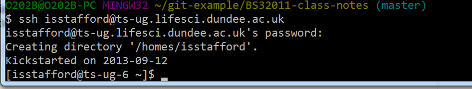

# Bash Commands

`pwd` - Ehows my current location in the file system

`cd directory` - Change to a specific directory

`cd` - Change to home directory

`cd ..` - Go up one directory

`cd -` - Change to the previous directory

`ls` - List files in that directory

`mkdir` - Create a new folder

`less {file}` - Read a file one page at a time; __Q__ to quit, __ENTER__ to go down a line, __SPACE__ to go down a page

`rm {file}` - Deletes a file (there is no undelete)

`nano {file}` - Create a file and begin adding text into this file, save it, and exit nano editor (you can use any editor available)

`cat {file}` - Show file contents (i.e. the text within)

# Git Commands

#### PULL AND PUSH

`git pull origin master` - Pull changes from the remote repository to the local one

`git push {remote} {origin}` - Push local changes to the remote repository and update with the latest changes

======

#### SETTING UP

`git config --global user.email "{email}"` - Setup global git email

`git config --global user.name "{name}"` - Setup global git username

`git config --list` - Displays your settings and shows you the chosen name, email, and other relevant information

======

#### CREATE

`git clone ssh://user@domain.com/repo.git` - Clone an existing repository

`git init` - Create a new local repository and putting the directory under version control

======

#### LOCAL CHANGES

`git status` - Check any changed files in your working directory

`git diff` - Changes to tracked files

`git diff --staged` - Shows the difference between the last committed change and what's in the staging area

`git add` - Add all current changes to the next commit

`git add <file1><file2><file_n>` -Add several files to the staging area

`git commit -m "{message}"` - Save a version in the repository with the message.

`git commit -a "{message}"` - Commit all local changes in tracked files

`git commit -am "{message}"` - Will commit all files being tracked

======

#### COMMIT HISTORY AND STATUS

`git log` - Show all commits in reverse chronological order

`git log -p {file}` - Show changes over time for a specific file

`git blame {file}` - Who changed what and when in file

`git status` - Current status of the repository

`git checkout -- {file}` - Restore the last committed version of file

`git log` - Show a commit history

`git diff HEAD~{X} {file}` - View the different changes at different steps to refer to old commits, where X refers to a number (for example the number 2 would show the second last commit done)

`git diff {log number} {file}` - Refer to commits using the saved git log string of digits that are unique to the commit, and you can either type out the whole line of digits or approximately the first ten digits

`git reset HEAD file_name` - Unstages file changes in the staging area

`git reset SHA` -Can be used to reset to a previous commit in your commit history.

======

#### IGNORE

`nano .gitignore` - Create a file with written text, showing the core extensions of the files that require ignoring and not to be viewed (for example .dat is written for files like a.dat, b.dat, c.dat to be ignores)

`git add -f {file.extension}` - Command overrides the ignore settings set in .gitignore and will add file.extension

`git status ignored` - View the status of ignored files withn .gitignore

======

#### BRANCHING

`git branch` - Lists all a Git project's branches.

`git branch branch_name` - Creates a new branch.

`git checkout branch_name` - Used to switch from one branch to another.

`git merge branch_name` - Used to join file changes from one branch to another.

`git branch -d branch_name` - Deletes the branch specified.

`git tag tag_name` - adds a human readable commit label. See [the Git tag documentation](https://git-scm.com/book/en/v2/Git-Basics-Tagging) for more information and note the specific comments about pushing tags to the remote server.

### Cloning and syncing a branch

1. Create a local copy of the repository with `git clone <repo url>` (you have probably already done this)
2. Switch to your branch with `git checkout mybranch`
3. Add a remote origin with a specific branch with 'git remote add -t mybranch myorigin <repo url>`
4. Sync the remote repository with the local one with `git pull myorigin`

=====

___N.B - Everything within {  } is a specific name, line of text, or referring to something that is unique and is not part of the command you type out___

======

See [this article](http://journals.plos.org/ploscompbiol/article?id=10.1371/journal.pcbi.1004668) for an overview and introduction to git

# Logging in to the teaching server

You can only log on from the campus network (Lifesci or UoD IT suites - UoD wireless may be difficult)

Point your ssh client to `ts-ug.lifesci.dundee.ac.uk` and login with your username/password (or use SSH keys if you know how to set that up)

You have all the Unix tools there, like `git` and so on. The preferred way to sync software and scripts is with `git`, though you can use `scp` to copy data to/from the server.

